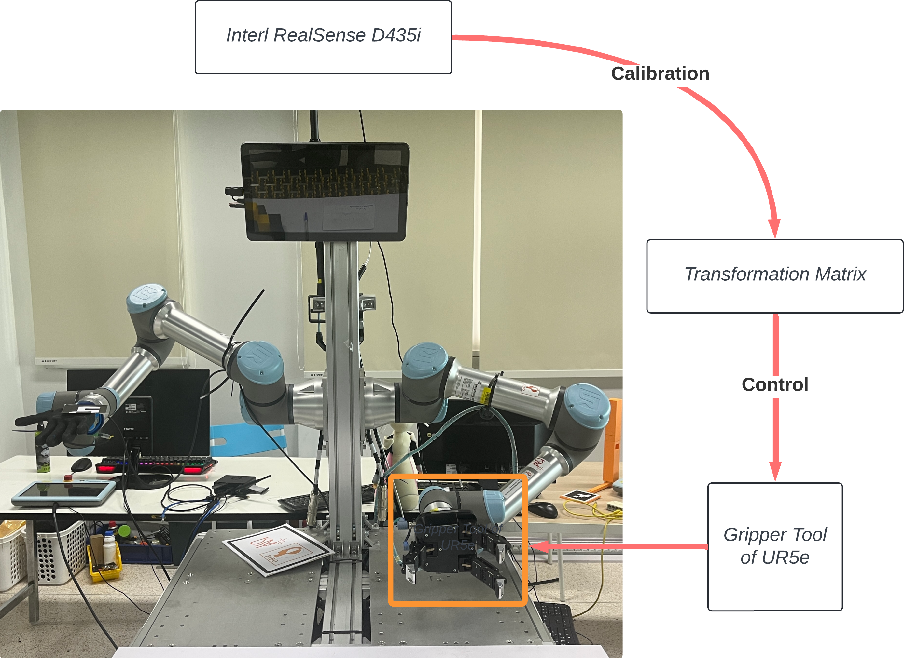
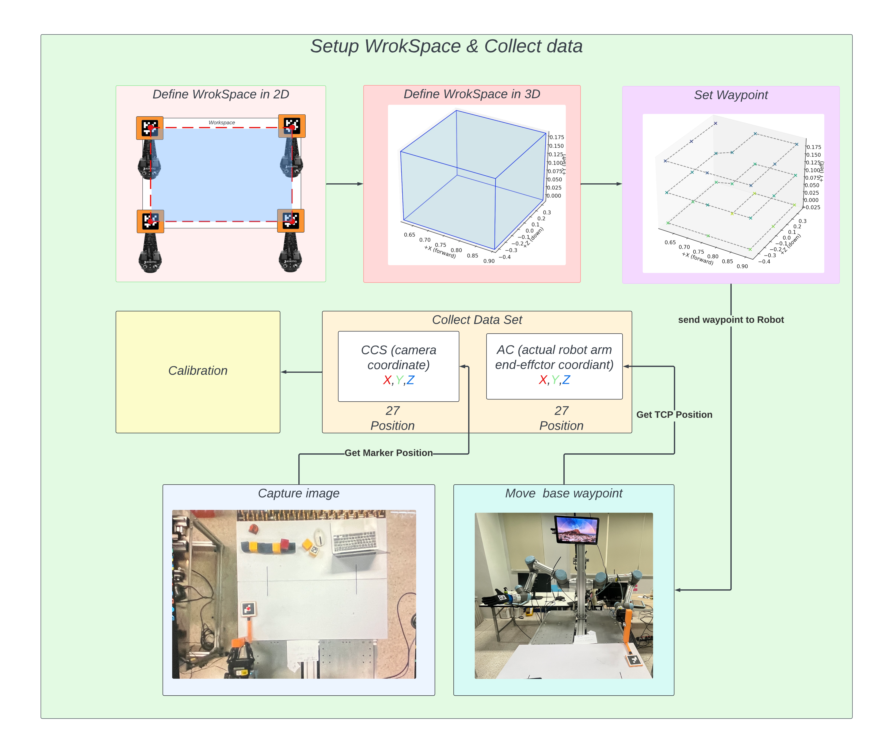
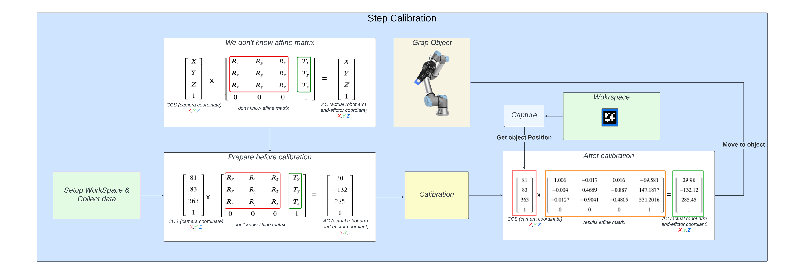
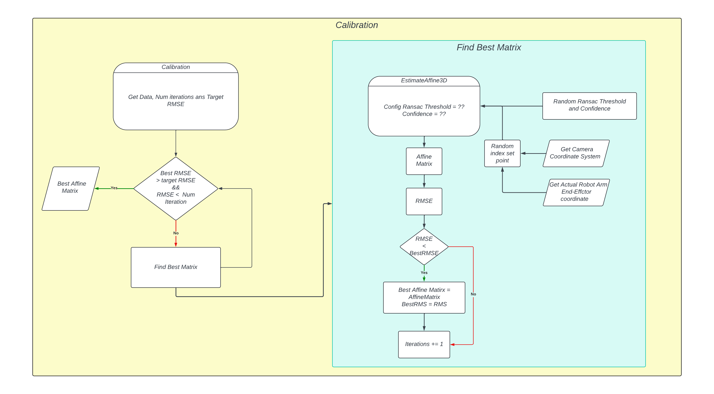
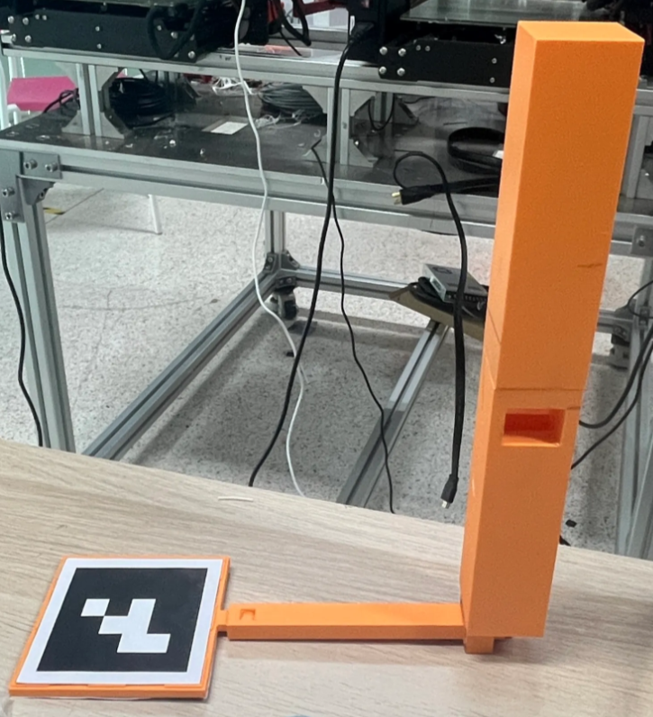
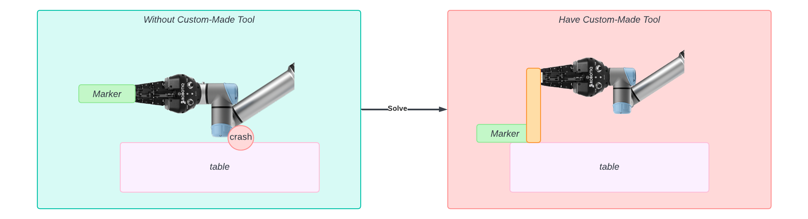
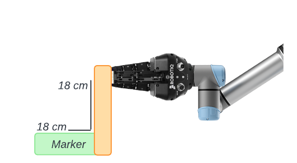
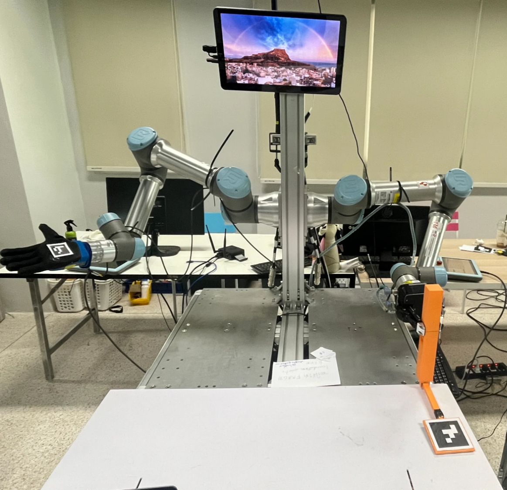
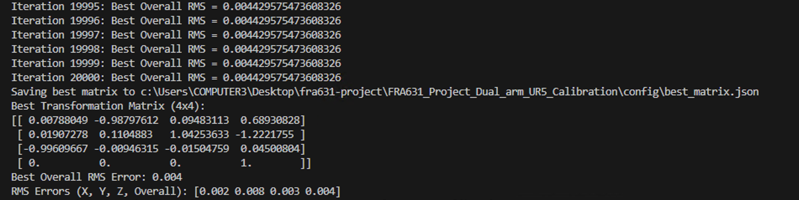

# FRA631 Project Dual arm UR5 Calibration
Repo for Calibration between camera and UR5e (Robot Arm)

## Overview Diagram


## Installation

> [!Note] This project's Python package is only supported on Python 3.11.XX and not beyond this version.
> To be sure, you can check the version of Python by running the following command in your terminal:
> ```bash
> python --version
> ```

step 1: Clone the repository

```bash
git clone https://github.com/peeradonmoke2002/FRA631_Project_Dual_arm_UR5_Calibration.git
```

step 2: Create a virtual environment and activate it

For Linux or MacOS:

```bash
python3 -m venv calibration_venv
source calibration_venv/bin/activate
```

For Windows:

```bash
set-executionpolicy -Scope CurrentUser -ExecutionPolicy Unrestricted
python -m venv calibration_venv
venv\Scripts\Activate.ps1
```

step 3: Install the required packages

If you are developer 

```bash
pip install -r dev-requirements.txt
```

If you are installing on a robot

```bash
pip install -r robot-requirements.tx
```

## Concept of Calibration

### **How it works**
The robot arm are following the camera’s instructions to reach the right spot. To make this work we need matrix transformation that help camera and robot understand each other. But before that we need to find that matrix transformation by use calibration methods.




### **Why use Affine Matrix?**

To convert between the 3D coordinate systems of a 3D camera and robot arm, an affine matrix is employed. The choice of an affine matrix is justified because it allows for translation, rotation, and scaling (dilation), providing the necessary flexibility to accurately align and adjust the two sets of 3D coordinates
More information [this link](https://towardsdatascience.com/understanding-transformations-in-computer-vision-b001f49a9e61)

### **How to Calibrate with Affine Matrix?**

1. **Setup workspace and collect data**



Before we can calibrate, we need to create a shared space where the camera and robot can work together.

**Step-by-step:**

- **Define 2D Workspace**
    
    Place ArUco markers at four corners. This helps the camera see the area the robot will work in.
    
- **Define 3D Workspace**
    
    From the 2D area, we build a 3D box to show the full space where the robot will move.
    
- **Set Waypoints**
    
    Choose 27 points inside the 3D space where the robot will move to collect data.
    
- **Move and Capture**
    
    At each point, the robot moves, and the camera takes a photo.
    
    - The **camera** records the marker’s position (X, Y, Z).
    - The **robot** records its end-effector’s position (X, Y, Z).
- **Collect Data**
    
    We now have 27 matching positions from both camera and robot.
    

This data will be used to calculate the matrix that helps both systems understand each other.

2. **Step Calibration** 



Now that we’ve collected the data, it’s time to calibrate. This step helps the robot understand where things are in the camera’s view.

**Before Calibration**

At first, the robot doesn’t know how the camera's coordinates match its own. We need to find the **affine matrix** — a special formula that links both systems.

**Calibration Process**

- We use the 27 matching points from both camera and robot.
- Using these points, we calculate the affine matrix.
- This matrix includes rotation, translation, and scaling between the two coordinate systems.



The system repeats the process many times:

- It randomly selects points and settings (like threshold and confidence).
- It calculates the affine matrix and checks the error (called **RMSE**).
- If the new matrix gives a better (lower) RMSE, we save it.
- This continues until we reach a good enough result or hit the maximum number of tries.

In the end, we get the **best affine matrix** that helps the robot understand where objects are from the camera's view.

**After Calibration**

Once we have the affine matrix:

- We can convert any camera position to a robot position.
- For example, when the camera sees an object, the robot can use the matrix to move to the correct location and pick it up.

## Step to do Calibration

1. We use a custom-made tool that holds a marker (like the one in the photo). This tool helps us align the camera and robot.



**Why Use a Custom-Made Tool?**

The custom-made tool solves key problems during calibration:



**Without Custom-Made Tool**

- The marker is placed flat on the table.
- The robot's joint may **crash into the table** while trying to reach it.
- It’s hard to keep the marker **flat and stable**, which affects accuracy.

**With Custom-Made Tool**

- The tool **raises the marker** to a safe height.
- It holds the marker **parallel to the table**, helping the camera see it clearly.
- This setup makes calibration **safer and more precise**.

As shown in the image, the tool helps avoid crashes and ensures better alignment for accurate calibration.

**Adjusting TCP Position to Marker Position**

When collecting data, the robot’s TCP (Tool Center Point) is at the **gripper**, but the marker is held **18 cm away** in both X and Y directions.

To get the correct marker position, we need to **shift the TCP position**:



In this case:

- Add **+18 cm in X**
- Add **+18 cm in Y**

This converts the gripper’s position into the actual **marker position**, which is what we use for calibration.

This step is important to make sure the data from the robot matches the camera correctly.

1. We begin by defining the workspace using **four corner points** in 2D: bottom-left (BL), top-left (TL), top-right (TR), and bottom-right (BR). These positions help outline a flat surface area for the robot to work in. 

After defining the 2D area, we extend it into **3D** by creating multiple planes stacked vertically. In our setup:

- We use **3 planes**, spaced **10 cm apart**.
- This creates a 3D box where the robot can move and collect data at different heights.

This 3D workspace is used to generate waypoints for the robot to visit during calibration.

Please configure these values in your `main.py` file

```python
BL_ref = [0.6158402179629584, 0.18426921633782534, 0.3510680386492011]
TL_ref = [0.9034970156209872, 0.18431919874933683, 0.3510680386492011]
TR_ref = [0.9035034184486379, 0.18425659123476879, -0.43708867396716417]
BR_ref = [0.6158402179629584, 0.18424774957164802, -0.43708867396716417]

vertical_distance = 0.10  # 10 cm per plane
num_planes = 3
```

1. Once everything is set up, run the Python script to start the data collection process.

Run the following command:

```bash
python3 main.py
```

The robot will move to each waypoint in the 3D workspace, and the camera will record marker positions.

All collected data will be saved to a file named: `calibration_data.csv`




1. After collecting the data, the next step is to calculate the **best affine transformation matrix** using the CSV file.

Run the following command:

```bash
python3 caribration-affine_matrix.py
```

This script will:

- Load the position data from `calibration_data.csv`
- Calculate the best affine matrix using multiple iterations
- Save the result to:`best_matrix.json`

This matrix allows the robot to understand positions from the camera’s view and convert them into robot coordinates.

## **Calibration Results**



After running 20,000 iterations, the system found the best affine matrix with a very low error.

- **Best RMS Error**: 0.004
- **Per Axis Error**:
    - X: 0.002
    - Y: 0.008
    - Z: 0.003

The matrix was saved to a file for later use. With this matrix, the robot can now accurately move based on the object position from the camera’s view.